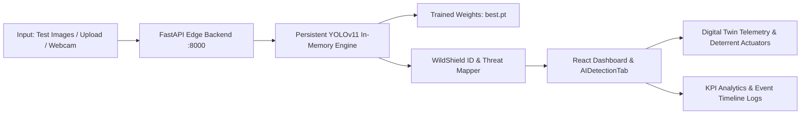

# WildShield AI — YOLO Model & Frontend Integration Guide

This guide describes how the trained **WildShield AI YOLOv11 Model** is integrated into the persistent FastAPI backend and connected in real-time to the React / Vite dashboard and Digital Twin.

---

## 1. Architecture Overview



---

## 2. Trained Model & Classes

* **Weights File**: `runs/detect/WildShield-Experiments/wildshield_surveillance_v1-2/weights/best.pt`
* **Target Classes**:
  * `0`: **Wild Boar** (`WS-WL-WB`) — High Threat — Intrusion: True — Protocol: `Siren + Floodlight`
  * `1`: **Nilgai** (`WS-WL-NG`) — Medium Threat — Intrusion: True — Protocol: `Floodlight + Alarm`
  * `2`: **Spotted Deer** (`WS-WL-SD`) — Medium Threat — Intrusion: True — Protocol: `Floodlight + Alarm`
  * `3`: **Rhesus Macaque** (`WS-WL-RM`) — Low Threat — Intrusion: True — Protocol: `Sprinkler / Warning`
  * `4`: **Gray Langur** (`WS-WL-LG`) — Low Threat — Intrusion: True — Protocol: `Sprinkler / Warning`
  * `5`: **Gaur** (`WS-WL-GR`) — Critical Threat — Intrusion: True — Protocol: `Siren + Floodlight`
  * `6`: **Cattle** (`WS-DM-CT`) — Low Threat (Domestic) — Intrusion: False — Protocol: `Sprinkler / Warning`
  * `7`: **Goat** (`WS-DM-GT`) — Low Threat (Domestic) — Intrusion: False — Protocol: `Warning`
  * `8`: **Human** (`WS-HM-HM`) — Security Alert — Intrusion: False — Protocol: `Security Alert`
  * `9`: **Vehicle** (`WS-VH-VH`) — Neutral — Intrusion: False — Protocol: `Log Only`

---

## 3. Required Dependencies

Install the Python inference dependencies:

```bash
pip install ultralytics torch torchvision fastapi uvicorn pillow opencv-python python-multipart
```

Install frontend dependencies:

```bash
npm install
```

---

## 4. How to Start the System

### Step 1: Start the FastAPI Inference Backend

From the repository root:

```bash
python -m uvicorn backend.server:app --host 127.0.0.1 --port 8000 --reload
```

The server loads the trained YOLO model into persistent memory during startup.

Health check:
```bash
curl http://127.0.0.1:8000/api/status
```

### Step 2: Start the Frontend Dashboard

In a second terminal:

```bash
npm run dev
```

Open `http://localhost:5173/` (or `http://localhost:5174/` depending on port availability) in your browser.

---

## 5. API Endpoints Reference

### 1. System Health & Model Info
* **Endpoint**: `GET /api/status`
* **Response**:
```json
{
  "status": "online",
  "model_loaded": true,
  "weights_path": ".../best.pt",
  "device": "cpu",
  "cuda_available": false,
  "classes": { "0": "Wild Boar", "1": "Nilgai", "2": "Spotted Deer", "6": "Cattle", "7": "Goat" },
  "test_images_count": 53
}
```

### 2. Run Inference on Test Dataset Image
* **Endpoint**: `POST /api/test-detect`
* **Payload**:
```json
{
  "filename": "WS-WL-WB-00004.jpg",
  "conf": 0.25,
  "node_id": 1
}
```
* **Response**:
```json
{
  "event_id": "WS-EVT-48192",
  "camera_id": "FN-1",
  "node_name": "North Field",
  "inference_time_ms": 142.5,
  "intrusion": true,
  "max_threat": "HIGH",
  "primary_detection": {
    "class": "Wild Boar",
    "code": "WS-WL-WB",
    "domain": "Wildlife",
    "confidence": 0.542,
    "confidence_pct": 54.2,
    "threat": "HIGH",
    "intrusion": true,
    "responses": ["Siren", "Floodlight"],
    "actuators": { "siren": true, "floodlight": true, "speaker": true, "sprinkler": false },
    "bbox": [120.0, 80.0, 420.0, 360.0],
    "normalized_bbox": [0.1875, 0.125, 0.6562, 0.5625]
  },
  "annotated_image": "data:image/jpeg;base64,..."
}
```

### 3. Run Inference on Uploaded Image
* **Endpoint**: `POST /api/detect`
* **Form-Data**: `file` (image binary), `conf` (0.25), `node_id` (1)

### 4. Run Inference on Webcam Frame
* **Endpoint**: `POST /api/detect-frame`
* **Payload**: `{ "image": "data:image/jpeg;base64,...", "conf": 0.25, "node_id": 1 }`

### 5. List Test Images
* **Endpoint**: `GET /api/test-images`

### 6. Event History
* **Endpoint**: `GET /api/events`

### 7. Modular Actuator Response Trigger (Safe Simulation)
* **Endpoint**: `POST /api/trigger-response`
* **Payload**:
```json
{
  "detection_id": "WS-EVT-48192",
  "species": "Wild Boar",
  "actuators": { "siren": true, "floodlight": true },
  "mode": "simulation"
}
```

---

## 6. Frontend Features & Usage

1. **AI Detection Tab**:
   * **Source Switcher**: Choose between **Test Dataset (53 unseen test images)**, **Live Webcam**, **Upload Photo**, or **Simulation**.
   * **Real Bounding Boxes**: Drawn with animal names, standard WildShield IDs (`WS-WL-WB`, `WS-WL-SD`, `WS-WL-NG`, `WS-DM-CT`, `WS-DM-GT`), confidence %, and **INTRUSION DETECTED** banner.
   * **Waiting State**: Shows **"No Detection / Waiting for Camera"** when idle.
   * **Live Pipeline Stepper**: Shows live 7-stage edge detection pipeline.
   * **Response Actions Card**: Activates Siren, Floodlight, Alert, and Event Log according to the species rules.

2. **Digital Twin Sync**:
   * Displays the full chain: `Farm → Camera Node → Detection Zone → Animal → Intrusion → Response`.
   * Automatically updates farm nodes, breach geofence highlights, and deterrent activation animations.

3. **KPIs & Timeline Sync**:
   * AI Detections counter and Intrusion counter increment on real detections.
   * Live timeline records formatted detection event logs (`[WS-WL-WB] Wild Boar identified at FN-1`).

---

## 7. Automated Test Procedure

To verify all classes on unseen test images:

```bash
python -c "
import urllib.request, json
test_cases = ['WS-WL-WB-00004.jpg', 'WS-WL-SD-00018.jpg', 'WS-WL-NG-00004.jpg', 'WS-DM-CT-00007.jpg', 'WS-DM-GT-00016.jpg']
for fn in test_cases:
    req = urllib.request.Request('http://127.0.0.1:8000/api/test-detect', data=json.dumps({'filename': fn, 'conf': 0.20, 'node_id': 1}).encode('utf-8'), headers={'Content-Type': 'application/json'})
    res = json.loads(urllib.request.urlopen(req).read().decode())
    pd = res.get('primary_detection', {})
    print(f'{fn} -> Class: {pd.get(\"class\")} [{pd.get(\"code\")}] Conf: {pd.get(\"confidence_pct\")}% Intrusion: {res.get(\"intrusion\")} Responses: {pd.get(\"responses\")}')
"
```
