# WildShield AI — Standard Identifier (ID) Representation Report
**Document Version:** 1.0  
**Project:** WildShield AI Digital Twin & Smart Deterrent System  
**Standard Schema:** `WS-[TYPE]-[SPECIES]-[ID]`

---

## 1. Executive Summary & Objective

In rural edge surveillance and autonomous deterrence, precise entity tracking across the entire data lifecycle is critical. The **WildShield Standard Identifier System** provides a deterministic, collision-free, human-readable, and machine-parseable ID format. 

This schema unifies:
1. **Raw Image Asset Storage** (Data ingestion & deduplication)
2. **YOLO Ground-Truth Annotations** (Dataset training and validation)
3. **Real-time Digital Twin Telemetry** (Multi-camera tracking & trajectory prediction)
4. **Threat Escalation & Deterrent Logs** (Autonomous deterrent firing records)

---

## 2. Anatomy of the WildShield ID

The standard identifier adheres to the 4-token hyphenated pattern:

$$\mathbf{WS}\text{ -- }\mathbf{[TYPE]}\text{ -- }\mathbf{[SPECIES]}\text{ -- }\mathbf{[ID]}$$

```text
  ┌────── Constant System Prefix ("WildShield")
  │   ┌── Entity Category Domain (2 letters)
  │   │   ┌── Target Species / Class Code (2 letters)
  │   │   │   ┌── Zero-padded Sequence Identifier (3–5 digits)
  ▼   ▼   ▼   ▼
  WS- WL- WB- 00001
```

### Token Definitions

| Token | Name | Length | Allowed Values | Description |
| :--- | :--- | :---: | :--- | :--- |
| **`WS`** | System Prefix | 2 chars | Fixed `WS` | Identifies the object as a WildShield platform entity. |
| **`[TYPE]`** | Domain Category | 2 chars | `WL`, `DM`, `HM`, `VH`, `BG` | Broad ecological and operational domain of the detected entity. |
| **`[SPECIES]`** | Species Code | 2 chars | `WB`, `NG`, `SD`, `RM`, `LG`, `GR`, `CT`, `GT`, `HM`, `VH` | Specific taxonomic or operational class code. |
| **`[ID]`** | Sequence Index | 3–5 digits | Numeric (`00001` to `99999`) | Monotonically increasing unique entity or sequence number. |

---

## 3. Master Code Reference Tables

### 3.1 Domain Categories (`[TYPE]`)

| Category Code | Domain | Description | Default Risk Level |
| :---: | :--- | :--- | :---: |
| **`WL`** | **Wildlife** | Wild animals subject to deterrent protocols | High / Medium |
| **`DM`** | **Domestic** | Farm livestock and domestic animals (non-harmful) | Low / Safe |
| **`HM`** | **Human** | Farmers, authorized personnel, or human trespassers | Neutral / Alert |
| **`VH`** | **Vehicle** | Tractors, motorcycles, agricultural machinery | Neutral / Filtered |
| **`BG`** | **Background** | False positive captures, wind sway, empty frames | Ignored |

---

### 3.2 Target Species & Class Mapping (`[SPECIES]`)

| YOLO Class ID | Species / Entity | Type | Species Code | Full ID Example | Common Local Names |
| :---: | :--- | :---: | :---: | :--- | :--- |
| **`0`** | **Wild Boar** | `WL` | `WB` | `WS-WL-WB-00001` | Raan Dukkar, Suwar |
| **`1`** | **Nilgai** (Blue Bull) | `WL` | `NG` | `WS-WL-NG-00001` | Nilgai, Rojh |
| **`2`** | **Spotted Deer** (Chital) | `WL` | `SD` | `WS-WL-SD-00001` | Chital, Haran |
| **`3`** | **Rhesus Macaque** | `WL` | `RM` | `WS-WL-RM-00001` | Bandar, Lal Maakad |
| **`4`** | **Gray Langur** | `WL` | `LG` | `WS-WL-LG-00001` | Hanuman Langur |
| **`5`** | **Gaur** (Indian Bison) | `WL` | `GR` | `WS-WL-GR-00001` | Indian Bison, Gava |
| **`6`** | **Cattle** (Cow / Ox) | `DM` | `CT` | `WS-DM-CT-00001` | Gai, Bail |
| **`7`** | **Goat** / Sheep | `DM` | `GT` | `WS-DM-GT-00001` | Bakri, Mendha |
| **`8`** | **Human** | `HM` | `HM` | `WS-HM-HM-00001` | Farmer, Trespasser |
| **`9`** | **Vehicle** | `VH` | `VH` | `WS-VH-VH-00001` | Tractor, Harvester |
| **—** | **Negative Sample** | `BG` | `BG` | `WS-BG-BG-00001` | Background / Brush |

---

## 4. Multi-Sensor & Camera-Trap Sequence Variant

When capturing burst sequences or multi-camera temporal streams from physical camera traps in farm perimeters, the ID extends to preserve burst provenance:

$$\mathbf{WS}\text{ -- }\mathbf{[TYPE]}\text{ -- }\mathbf{[SPECIES]}\text{ -- }\mathbf{[CAM\_ID]}\text{ -- }\mathbf{[SEQ\_ID]}\text{ -- }\mathbf{[FRAME\_ID]}$$

### Example
```text
WS-WL-WB-CAM02-S014-F003
```
* **`CAM02`**: Perimeter Camera Unit #2 (North Fence)
* **`S014`**: Burst Sequence Event #14
* **`F003`**: Frame #3 of the burst event

> **Purpose:** Prevents data leakage during Train/Val/Test splitting by ensuring that all frames sharing `WS-WL-WB-CAM02-S014` remain in the same split.

---

## 5. End-to-End Lifecycle Representation

```mermaid
flowchart LR
    A[Camera Trap Raw Capture] -->|Format: WS-WL-WB-00001.jpg| B[Deduplication & Storage]
    B -->|Generate: WS-WL-WB-00001.txt| C[YOLO Ground Truth Annotations]
    C -->|Split 70/20/10 by Sequence ID| D[Model Training & Evaluation]
    D -->|Real-time Edge Stream| E[Digital Twin Tracking ID]
    E -->|Threat Level Trigger| F[Autonomous Deterrent Log: WS-WL-WB-00001]
```



### 5.1 Dataset File Representation on Disk

```text
WildShield-Dataset/
├── raw/
│   ├── 0_Wild_Boar/
│   │   ├── WS-WL-WB-00001.jpg
│   │   └── WS-WL-WB-00002.jpg
│   ├── 1_Nilgai/
│   │   ├── WS-WL-NG-00001.jpg
│   │   └── WS-WL-NG-00002.jpg
│   └── 2_Spotted_Deer/
│       ├── WS-WL-SD-00001.jpg
│       └── WS-WL-SD-00002.jpg
│
├── train/
│   ├── images/
│   │   ├── WS-WL-WB-00001.jpg
│   │   └── WS-WL-SD-00002.jpg
│   └── labels/
│       ├── WS-WL-WB-00001.txt
│       └── WS-WL-SD-00002.txt
│
└── test/
    ├── images/
    │   └── WS-WL-WB-00099.jpg
    └── labels/
        └── WS-WL-WB-00099.txt
```

---

## 6. Digital Twin Telemetry & Threat Event Representation

In the WildShield Digital Twin dashboard and incident logs, the ID is embedded directly into JSON telemetry payloads:

```json
{
  "event_id": "EVT-20260829-00912",
  "timestamp": "2026-08-29T21:14:32Z",
  "sensor_id": "PERIMETER_CAM_03",
  "target_entity": {
    "wildshield_id": "WS-WL-WB-00142",
    "domain": "Wildlife",
    "species": "Wild Boar",
    "confidence": 0.94,
    "bounding_box": {
      "x_center": 0.542,
      "y_center": 0.618,
      "width": 0.312,
      "height": 0.405
    },
    "threat_assessment": {
      "level": "CRITICAL",
      "zone": "INNER_CROP_ZONE",
      "speed_mps": 2.4,
      "deterrent_dispatched": "ULTRASONIC_STROBE_FREQ_B"
    }
  }
}
```

---

## 7. Python Verification & Parsing Implementation

```python
import re
from typing import Optional, Dict

class WildShieldID:
    # Standard format: WS-[TYPE]-[SPECIES]-[ID]
    PATTERN_STD = re.compile(r"^WS-(WL|DM|HM|VH|BG)-([A-Z]{2})-(\d{3,5})$")
    
    # Sequence format: WS-[TYPE]-[SPECIES]-[CAM_ID]-[SEQ_ID]-[FRAME_ID]
    PATTERN_SEQ = re.compile(r"^WS-(WL|DM|HM|VH|BG)-([A-Z]{2})-([A-Z0-9]+)-(S\d+)-(F\d+)$")

    @classmethod
    def validate(cls, identifier: str) -> bool:
        """Return True if the ID matches standard or sequence specification."""
        return bool(cls.PATTERN_STD.match(identifier) or cls.PATTERN_SEQ.match(identifier))

    @classmethod
    def parse(cls, identifier: str) -> Optional[Dict]:
        """Parse token components from a valid WildShield ID."""
        match_std = cls.PATTERN_STD.match(identifier)
        if match_std:
            type_code, species_code, seq_id = match_std.groups()
            return {
                "format": "STANDARD",
                "type": type_code,
                "species": species_code,
                "sequence_id": int(seq_id),
                "full_id": identifier
            }
        
        match_seq = cls.PATTERN_SEQ.match(identifier)
        if match_seq:
            type_code, species_code, cam_id, seq_id, frame_id = match_seq.groups()
            return {
                "format": "SEQUENCE",
                "type": type_code,
                "species": species_code,
                "camera_id": cam_id,
                "sequence_id": seq_id,
                "frame_id": frame_id,
                "full_id": identifier
            }
        return None

# Verification Demonstration
if __name__ == "__main__":
    sample_ids = [
        "WS-WL-WB-00001",
        "WS-WL-NG-00045",
        "WS-DM-CT-00102",
        "WS-WL-SD-CAM02-S014-F003",
        "INVALID-ID-123"
    ]
    for sid in sample_ids:
        print(f"ID: {sid:30s} -> Valid: {WildShieldID.validate(sid)} | Parsed: {WildShieldID.parse(sid)}")
```

---

## 8. Summary of Benefits

1. **Zero Naming Ambiguity**: Distinct separation between Wildlife (`WL`), Livestock (`DM`), Humans (`HM`), and Vehicles (`VH`).
2. **Deterministic File Linking**: Every image (`WS-WL-WB-00001.jpg`) pairs 1-to-1 with its YOLO annotation (`WS-WL-WB-00001.txt`).
3. **Leakage-Free Splitting**: Sequence keys enable strict temporal splitting for burst cameras.
4. **Digital Twin Traceability**: Links raw camera frames to real-time farm deterrence logs without re-indexing.
